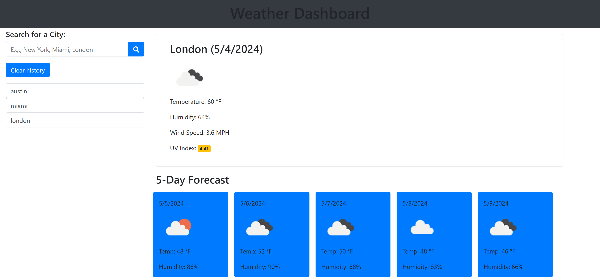

# Weather Dashboard
## Project Description
The Weather Dashboard project consist of a 5 Days weather forecast for searched cities and search history to pull from local storage and display on screen.

## Acceptance Criteria

User Story

AS A traveler
I WANT to see the weather outlook for multiple cities
SO THAT I can plan a trip accordingly

Acceptance Criteria

GIVEN a weather dashboard with form inputs
WHEN I search for a city
THEN I am presented with current and future conditions for that city and that city is added to the search history
WHEN I view current weather conditions for that city
THEN I am presented with the city name, the date, an icon representation of weather conditions, the temperature, the humidity, and the wind speed
WHEN I view future weather conditions for that city
THEN I am presented with a 5-day forecast that displays the date, an icon representation of weather conditions, the temperature, the wind speed, and the humidity
WHEN I click on a city in the search history
THEN I am again presented with current and future conditions for that city

## Website Page Screenshot

https://edrivera016.github.io/Weather-App/

## Comments 
* Developed a weather dashboard
* Added a search bar to look for any city.
* Added A clear button to clear any search history saved on local storage.
* Implemented a section to display current weather and a section to display forecast for the next 5 days.
* Added a area where search history will appearand you can click on any city and it will give you the current and 5 days forecast.
* Implemented Font Awesome to display search icon.
* OpenWeather Api for forecast.
* API to display the current weather in an icon.

## Contributions 
* https://openweathermap.org/api
* https://www.bootstrapcdn.com/
* https://cdnjs.com/libraries/font-awesome/5.11.2
  